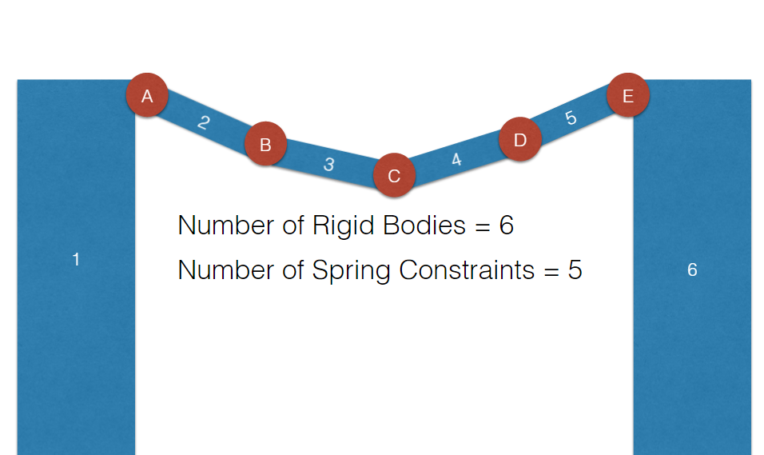

# Bullet Physics Rope Bridge

# Brief 
Start with the example_shapes and add a bridge using physics constraints. 

# [Video link](https://www.youtube.com/watch?v=_qgusqLWf4I&feature=youtu.be "Video Link")

# Introduction 

In this project there are few different physical effects happening to the objects in the scene. There are spring constraints holding the bridge planks together, there are forces and torques being added to the ball and swinging box. There is a hinge constraint allowing the box to swing. 

The implementation of the spring and hinge constraints were added to the visual scene file instead of the main header file so that the Bullet physics would be abstracted from the program code. This means that if bullet updates or changes how there constraints work, only the visual scene would need to be edited. 

# Spring Constraints

Spring constraints work on all 6 of the axis. In this implementation, we are only working on the X-axis. The function in Bullet physics to use a spring takes in six variables. Two rigid bodies, two pivot points and two axis definitions. 

Explanation of each variable:
- Rigid body A and B are used to get the physical object that is being constrained together. These rigid bodies also have other forces acting on them. For example the weight of the balls on the bridge. 
- The pivot points are the edge of the physics objects that you want to constraint. In this implementation pivot A is the right side of the object and pivot B is the left of the object. This gives a better representation of the real world as the objects are being pulled together from the sides instead of the middle which will result in the object rotating to match each other. 
- The axis variables define which axis of the object they are constraining. If the axis on this example were different then it would flip on of the object around until they had the same orientation. The axis are set to the X axis on both objects.  

The way that the bridge is implemented is very simple. There is an array of rigid bodies, which are attached to each of the objects of the bridge. There is one less spring constraint then objects and the first and last object are static so that neither gravity nor forces are applied to the banks. In this implementation there are twice as many spring constraints, one at each end of the planks. The reason for this is to have a more realistic representation of a rope bridge. 

 

# Forces acting on the Ball

The ball object in the scene has two linear forces applied to it. The forces are controlled by the user pressing the arrow keys, allowing movement of the ball in a straight line along the X and Z axis. The ball is being pushed around the scene, instead of a translation. This means that the mesh is moving because of the movement of the ball's rigid body. 

Aswell as the two forces being applied, there is an inherent downwards force. This mimics gravity for all dynamic objects in the scene. 

# Adding a Torque to the Box

Torque is a rotational force which is applied constantly around a point. This will swing the objects around a set point instead of pushing them. When comparing a force and a torque, you can look at the example of a force acting on a cube, which would push the cube, whereas a torque would try to rotate the cube in the direction of vector.

A torque was used in this project to make the cube, which is constrainted by the hinge, to rotate or swing. Key presses were attached to the torque impulse. This allows to force to degrade over time.  

# Adding a Hinge constraint to the Box 

A Hinge constraint brings together two objects, it limits their movement to one axis defined by a three dimentional vector. The hinge will keep the object at the same distance from the pivot point. In this program the box is only allow to rotate on the Z axis. Its position depends on the torque being applied. If a torque was applied on a different axis then the hinge would constraint the box and no effect would be shown.    

